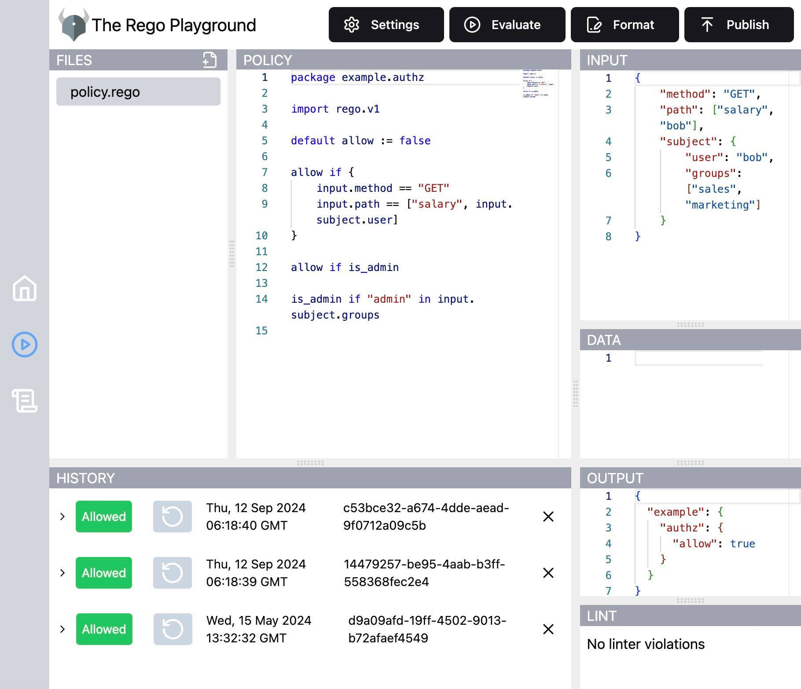
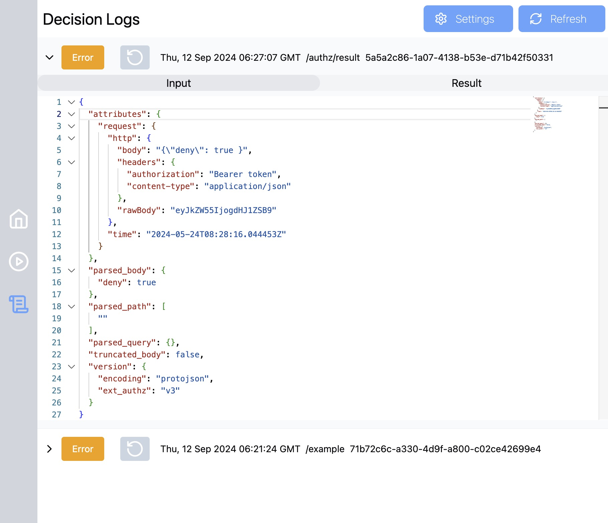

# OPA Management Application

This project aims to provide a simple and easy way to host your own OPA playground,
manage your policies and data, and test them against your own services.

## Features

- **OPA Playground**: A simple playground to test your policies and data.
- **Policy Management**: Manage your policies and data.
- **Service Testing**: Test your policies against your own services.
- **Decision Logs**: View the decision logs of your policies.

|                 Playground                 |                 Decision Logs                 |
| :----------------------------------------: | :-------------------------------------------: |
|  |  |

## Installation

### Environment Variables

| Variable              | Type                                 | Description                           | Default                                                                 |
| --------------------- | ------------------------------------ | ------------------------------------- | ----------------------------------------------------------------------- |
| `TRANSPORT_HTTP_PORT` | `int`                                | The port to run the HTTP server on    | `6060`                                                                  |
| `LOG_LEVEL`           | `int`                                | The log level of the application      | `0`                                                                     |
| `OPA_DOWNLOAD_URL`    | `string`                             | The URL to download the OPA server on | `https://openpolicyagent.org/downloads/v0.64.1/opa_darwin_arm64_static` |
| `REVISION_CONFIG_*`   | [Revision Config](#revision_config_) | Revision API's                        | ``                                                                      |

#### `REVISION_CONFIG_*`

Revisions are used to fetch the policies and data from a repository, so that requests can be replayed against a specific revision.

> **Note:** If the provider you're seeking is not listed, you can implement your own provider by implementing the [Provider interface](./contract/repositories.go).

##### Gitlab Packages Registry

| Variable                                        | Type              | Description                          | Default                                           |
| ----------------------------------------------- | ----------------- | ------------------------------------ | ------------------------------------------------- |
| `REVISION_CONFIG_TYPE`                          | `gitlab_packages` | Set the type to `gitlab_packages`    | ``                                                |
| `REVISION_CONFIG_GITLAB_PACKAGES_URL`           | `string`          | The URL to the Gitlab Packages API   | `https://gitlab.com/api/v4/projects/xxx/packages` |
| `REVISION_CONFIG_GITLAB_PACKAGES_PRIVATE_TOKEN` | `string`          | The private token to use for the API | `glpat-xxxx-xxxx-xxxx-xxxx`                       |

##### Gitlab Container Registry

| Variable                                         | Type               | Description                              | Default                                           |
| ------------------------------------------------ | ------------------ | ---------------------------------------- | ------------------------------------------------- |
| `REVISION_CONFIG_TYPE`                           | `gitlab_container` | Set the type to `gitlab_container`       | ``                                                |
| `REVISION_CONFIG_GITLAB_CONTAINER_URL`           | `string`           | The URL to the Gitlab Container Registry | `https://gitlab.com/api/v4/projects/xxx/packages` |
| `REVISION_CONFIG_GITLAB_CONTAINER_PRIVATE_TOKEN` | `string`           | The private token to use for the API     | `glpat-xxxx-xxxx-xxxx-xxxx`                       |

## Usage

The most basic usage of this application is to run the playground locally without a OPA server.
This limits the functionality to just writing and testing policies and data.

To make full use of the application, including it's features to browse and replay decisions, you need to run a OPA server.

### Run an OPA server

The application has an endpoint for processing decision logs, which need to be configured in the OPA configuration yaml at startup.

There are 2 parts of the configuration that are important for the application to work, the `decision_logs` and the `services` section.
In the `services` section you need to point to the `oma` service, which is the decision logs API.
And in the `decision_logs` section you need enable reporting and point to the `oma` service.

A simple configuration could look like this, which can also be found at [./opa-config.example.yaml](./opa-config.example.yaml):

```yaml
decision_logs:
  service: oma # The service name must match one of the services in the services section.
  reporting:
    min_delay_seconds: 1
    max_delay_seconds: 3
  console: true

services:
  oma:
    url: http://localhost:8080/api/decision-log
    response_header_timeout_seconds: 5
```

Then start the OPA server with the configuration file:

```bash
opa run --server --config-file=./opa-config.example.yaml --addr=localhost:8181 --diagnostic-addr=localhost:8282
```

## Workaround VECOZO workstation issues

When developing this app on VECOZO corporate workstations, antivirus measures may block the download of the trifles package when executing a `go build`. A workaround is to download the package manually and place it in a `gocache` directory. Afterwards the package can be replaced with the local version (see `go.mod.vecozo`).

Unpack trifles package:

```bash
wget https://proxy.golang.org/github.com/dgryski/trifles/@v/v0.0.0-20230903005119-f50d829f2e54.zip
unzip v0.0.0-20230903005119-f50d829f2e54.zip -d ../gocache
cd ../gocache/github.com/dgryski/trifles@v0.0.0-20230903005119-f50d829f2e54
go mod init trifles
go mod tidy
```

Tidy up the go.mod file with local trifles package:

```bash
vecozo_tidy.sh
```

Build app with local trifles package:

```bash
vecozo_build.sh
```
